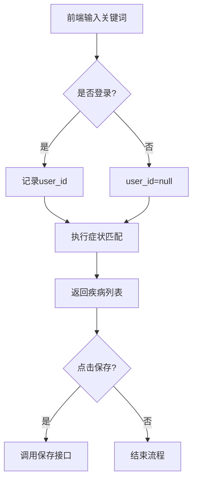

# 症状自检助手模块技术文档（修订版）

## 一、功能架构

```text
1. 症状关键词模糊匹配疾病
2. 登录用户记录保存与查询
3. 疾病详情联动跳转
4. 权限分层控制（游客/用户）

疾病匹配逻辑：改用LIKE模糊匹配，处理多个关键词，每个关键词独立匹配后整合结果。
前端页面路由：症状详情页复用疾病详情页组件，路由权限增加登录校验。
权限控制：在拦截器中检查/symptom/save路径的登录状态。
分页处理：暂时不实现。
未来整合：暂不整合历史搜索表。
 RespResult已在 world.tangjp.result包中定义
 
```

3. **其他问题确认**
   | 问题点 | 结论 | 补充说明 |
   |--------------|------------------------------|------------------------------|
   | 分页处理 | **暂不实现**                | 需产品确认是否需要后期追加 |
   | 历史搜索整合 | **保持独立表**              | symptom_log表独立存储记录 |
   | 路由权限 | `/symptom/list`需登录 | 前端路由+后端接口双重校验 |
3. **其他问题确认**  
   | 问题点 | 结论 | 补充说明 |
   |--------------|------------------------------|------------------------------|
   | 分页处理 | **暂不实现** | 需产品确认是否需要后期追加 |
   | 历史搜索整合 | **保持独立表** | symptom_log表独立存储记录 |
   | 路由权限 | `/symptom/list`需登录 | 前端路由+后端接口双重校验 |


### 二、核心要点整理

#### 技术方案矩阵
```markdown
| 模块           | 技术决策                                      | 关联影响                |
|----------------|-----------------------------------------------|-------------------------|
| 疾病匹配       | 多关键词AND逻辑 + LIKE模糊匹配                | 需重建测试用例          |
| 权限控制       | 会话层拦截`/symptom/save`接口                | 不影响现有鉴权体系      |  
---

## 二、数据库变更

```sql
-- 新增症状搜索记录表（与现有表兼容）
CREATE TABLE `symptom_log` (
                               `id` int NOT NULL AUTO_INCREMENT,
                               `user_id` int DEFAULT NULL COMMENT '游客无user_id',
                               `keyword` varchar(255) NOT NULL COMMENT '症状关键词',
                               `matched_illness_ids` varchar(255) DEFAULT NULL COMMENT '逗号分隔的疾病ID',
                               `create_time` datetime DEFAULT CURRENT_TIMESTAMP,
                               PRIMARY KEY (`id`),
                               KEY `fk_user_id` (`user_id`),
                               CONSTRAINT `fk_user_id` FOREIGN KEY (`user_id`) REFERENCES `user` (`id`) ON DELETE SET NULL
) ENGINE=InnoDB DEFAULT CHARSET=utf8mb4;
```

---

## 三、接口规范（符合项目规范）

### 1. 症状搜索接口


### 2. 记录保存接口


---

## 四、安全控制

### 2. 输入校验

```java
// 保存参数DTO
@Data
public class SymptomSaveDTO {
    @NotBlank(message = "关键词不能为空")
    private String keyword;

    @Pattern(regexp = "^d+(,d+)*$", message = "疾病ID格式错误")
    private String illnessIds;

    @NotNull(message = "首疾病ID不能为空")
    private Integer firstIllnessId;
}
```

---

## 五、前端实现方案

### 1. 症状列表页（symptom-search.html）

```html
<!-- 搜索表单 -->
<div class="search-box">
    <input type="text" id="keywordInput" placeholder="输入症状关键词（空格分隔）">
    <button onclick="handleSearch()">症状自检</button>
</div>

<!-- 结果表格 -->
<table th:if="${not empty logs}">
    <tr th:each="log : ${logs}">
        <td th:text="${log.id}"></td>
        <td th:text="${log.keyword}"></td>
        <td>
            <span th:text="${log.firstIllness} ?: '无匹配'"></span>
            <span th:if="${#lists.size(log.illnessIds.split(',')) > 1}">...</span>
        </td>
        <td>
            <a th:href="@{/symptom/detail?id={id}(id=${log.id})}">查看</a>
            <button th:if="${session.LoginUser != null}"
                    onclick="deleteLog(${log.id})">删除
            </button>
        </td>
    </tr>
</table>
```

### 2. 自检弹窗逻辑

```javascript
function handleSearch() {
    const keyword = $('#keywordInput').val().trim();
    if (!keyword) return alert('请输入关键词');

    showLoadingModal(); // 显示加载弹窗

    // 模拟2秒延迟
    setTimeout(() => {
        fetch(`/symptom/search?keyword=${encodeURIComponent(keyword)}`)
            .then(res => res.json())
            .then(data => {
                if (data.code === 200) {
                    showResultModal(data.data);
                } else {
                    showError(data.msg);
                }
            })
    }, 2000);
}

function showResultModal(illnesses) {
    // 显示结果弹窗（包含保存按钮）
    const illnessNames = illnesses.slice(0, 3).map(i => i.illnessName);
    const resultText = `可能是：${illnessNames.join('、')}${illnesses.length > 3 ? '...' : ''}`;

    // 弹窗渲染逻辑...
}
```

---

## 六、数据流说明



---

## 七、排期规划

模块 开发内容 工期 交付物  
后端接口 症状搜索/保存接口开发 1.5天 可调用的API接口  
前端实现 自检页面与交互开发 1天 symptom-search.html  
测试 功能测试与联调 0.5天 测试报告

---

## 八、注意事项

- 分词处理：直接使用空格分割关键词（如"头痛 发热"拆分为["头痛","发热"]）
- 疾病匹配：使用LIKE模糊匹配，每个关键词独立匹配后整合结果
- 首疾病显示：取匹配结果的第一条疾病名称，多余显示省略号 （前端实现）
- 删除权限：前端隐藏非当前用户的删除按钮，后端校验用户权限
- 游客限制：无症状记录查询功能，仅允许登录用户查看历史  