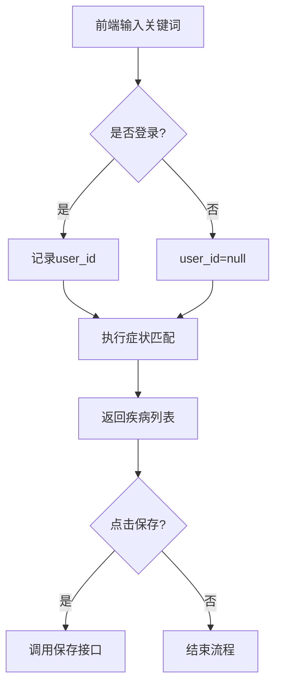

# 症状自检助手模块技术文档（修订版）

## 一、功能架构
```text
1. 症状关键词模糊匹配疾病
2. 登录用户记录保存与查询
3. 疾病详情联动跳转
4. 权限分层控制（游客/用户）
```

---

## 二、数据库变更

```sql
-- 症状记录表（兼容游客场景）
CREATE TABLE `symptom_log` (
  `id` int NOT NULL AUTO_INCREMENT,
  `user_id` int DEFAULT NULL COMMENT '用户ID（允许NULL表示游客）',
  `keyword` varchar(255) NOT NULL COMMENT '原始输入关键词',
  `illness_ids` varchar(255) COMMENT '逗号分隔的疾病ID',
  `first_illness` varchar(100) COMMENT '首条疾病名称（冗余存储）',
  `create_time` datetime DEFAULT CURRENT_TIMESTAMP,
  PRIMARY KEY (`id`),
  KEY `idx_user_create` (`user_id`,`create_time`),
  CONSTRAINT `fk_symptom_user` FOREIGN KEY (`user_id`) REFERENCES `user` (`id`) ON DELETE SET NULL
) ENGINE=InnoDB DEFAULT CHARSET=utf8mb4;

-- 疾病表新增全文索引（症状模糊匹配优化）
ALTER TABLE illness 
ADD FULLTEXT INDEX idx_symptom_fulltext (illness_symptom) 
WITH PARSER ngram;
```

---

## 三、接口规范（符合项目规范）

### 1. 症状搜索接口

```java
@Api(tags = "症状自检接口")
@RestController
@RequestMapping("/symptom")
public class SymptomController extends BaseController<SymptomLog> {

    @ApiOperation(value = "症状匹配查询", notes = "支持游客访问")
    @GetMapping("/search")
    public RespResult<List<IllnessVO>> searchSymptoms(
            @RequestParam @ApiParam(value = "症状关键词", example = "头痛 发热", required = true) String keyword,
            HttpServletRequest request) {

        // 关键词清洗（去除多余空格）
        String cleanKeyword = keyword.trim().replaceAll("s+", " ");
        
        // 查询逻辑（使用MyBatis-Plus条件构造器）
        List<Illness> illnesses = illnessService.lambdaQuery()
            .apply("MATCH(illness_symptom) AGAINST ({0} IN NATURAL LANGUAGE MODE)", cleanKeyword)
            .list();
            
        return RespResult.success(BeanUtil.copyList(illnesses, IllnessVO.class));
    }
}
```

### 2. 记录保存接口

```java
@ApiOperation(value = "保存检测记录", notes = "需登录后操作")
@PostMapping("/save")
public RespResult<?> saveSymptomLog(
        @Valid @RequestBody SymptomSaveDTO saveDTO,
        @ApiIgnore @SessionAttribute(value = "LoginUser", required = false) User loginUser) {
    
    // 登录校验（复用项目统一拦截器）
    if (loginUser == null) {
        return RespResult.fail(HttpStatus.UNAUTHORIZED.value(), "请先登录");
    }
    
    // 获取首条疾病名称
    String firstIllnessName = illnessService.getById(saveDTO.getFirstIllnessId())
        .map(Illness::getIllnessName)
        .orElse("未知疾病");
    
    // 构建存储对象
    SymptomLog log = new SymptomLog()
        .setUserId(loginUser.getId())
        .setKeyword(saveDTO.getKeyword())
        .setIllnessIds(saveDTO.getIllnessIds())
        .setFirstIllness(firstIllnessName);
    
    return super.save(log);
}
```

---

## 四、安全控制

### 1. 权限校验

```java
// 在统一拦截器中增加规则
public class AuthInterceptor implements HandlerInterceptor {
    @Override
    public boolean preHandle(HttpServletRequest req, HttpServletResponse res, Object handler) {
        // 保存接口需要登录
        if (req.getRequestURI().startsWith("/symptom/save")) {
            if (req.getSession().getAttribute("LoginUser") == null) {
                res.setStatus(401);
                return false;
            }
        }
        return true;
    }
}
```

### 2. 输入校验

```java
// 保存参数DTO
@Data
public class SymptomSaveDTO {
    @NotBlank(message = "关键词不能为空")
    private String keyword;
    
    @Pattern(regexp = "^d+(,d+)*$", message = "疾病ID格式错误")
    private String illnessIds;
    
    @NotNull(message = "首疾病ID不能为空")
    private Integer firstIllnessId;
}
```

---

## 五、前端实现方案

### 1. 症状列表页（symptom-search.html）

```html
<!-- 搜索表单 -->
<div class="search-box">
  <input type="text" id="keywordInput" placeholder="输入症状关键词（空格分隔）">
  <button onclick="handleSearch()">症状自检</button>
</div>

<!-- 结果表格 -->
<table th:if="${not empty logs}">
  <tr th:each="log : ${logs}">
    <td th:text="${log.id}"></td>
    <td th:text="${log.keyword}"></td>
    <td>
      <span th:text="${log.firstIllness} ?: '无匹配'"></span>
      <span th:if="${#lists.size(log.illnessIds.split(',')) > 1}">...</span>
    </td>
    <td>
      <a th:href="@{/symptom/detail?id={id}(id=${log.id})}">查看</a>
      <button th:if="${session.LoginUser != null}" 
              onclick="deleteLog(${log.id})">删除</button>
    </td>
  </tr>
</table>
```

### 2. 自检弹窗逻辑

```javascript
function handleSearch() {
  const keyword = $('#keywordInput').val().trim();
  if (!keyword) return alert('请输入关键词');
  
  showLoadingModal(); // 显示加载弹窗
  
  // 模拟2秒延迟
  setTimeout(() => {
    fetch(`/symptom/search?keyword=${encodeURIComponent(keyword)}`)
      .then(res => res.json())
      .then(data => {
        if (data.code === 200) {
          showResultModal(data.data);
        } else {
          showError(data.msg);
        }
      })
  }, 2000);
}

function showResultModal(illnesses) {
  // 显示结果弹窗（包含保存按钮）
  const illnessNames = illnesses.slice(0, 3).map(i => i.illnessName);
  const resultText = `可能是：${illnessNames.join('、')}${illnesses.length > 3 ? '...' : ''}`;
  
  // 弹窗渲染逻辑...
}
```

---

## 六、数据流说明



---

## 七、排期规划

模块	开发内容	工期	交付物  
后端接口	症状搜索/保存接口开发	1.5天	可调用的API接口  
前端实现	自检页面与交互开发	1天	symptom-search.html  
测试	功能测试与联调	0.5天	测试报告  

---

## 八、注意事项

- 分词处理：直接使用空格分割关键词（如"头痛 发热"拆分为["头痛","发热"]）  
- 疾病匹配：采用MySQL全文索引的MATCH AGAINST语法  
- 首疾病显示：取匹配结果的第一条疾病名称，多余显示省略号  
- 删除权限：前端隐藏非当前用户的删除按钮，后端校验用户权限  
- 游客限制：无症状记录查询功能，仅允许登录用户查看历史  